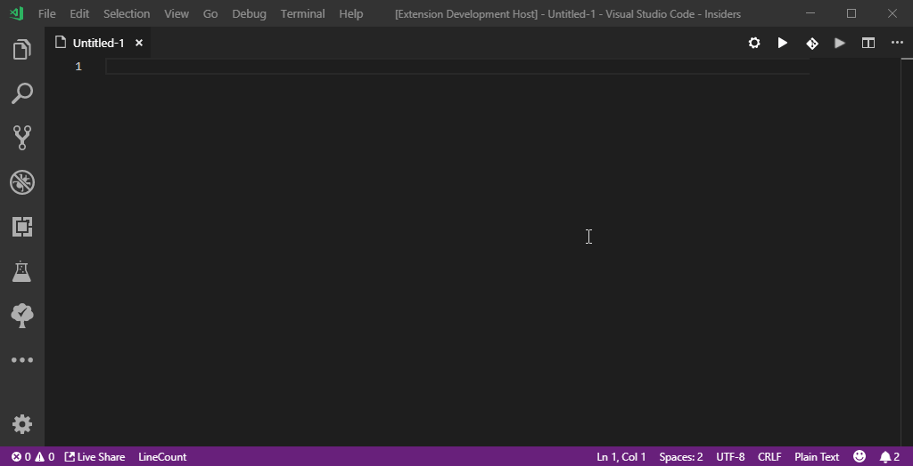

# GTHubIpsum

A VSCode extension that puts GTHub quotes as Lorem ipsum into your editor.

*For those that don't know what GTHub is, its a discord community about racing  cars, GT3, LMP1, F1... doesnt matter! \O/*

[GTHub]('https://GTHub.eu')

## Usage

Open command palette (Pressing *F1* or *Ctrl+Shift+P*) type __gthubsum__ and press press enter.

### Roadmap

Custom paragraph length, multiple paragraphs...

### Changelog

##### 0.1
  * Initial version.